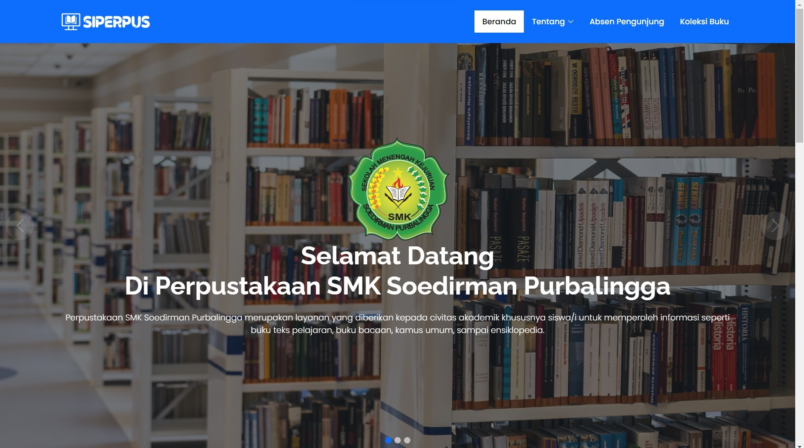
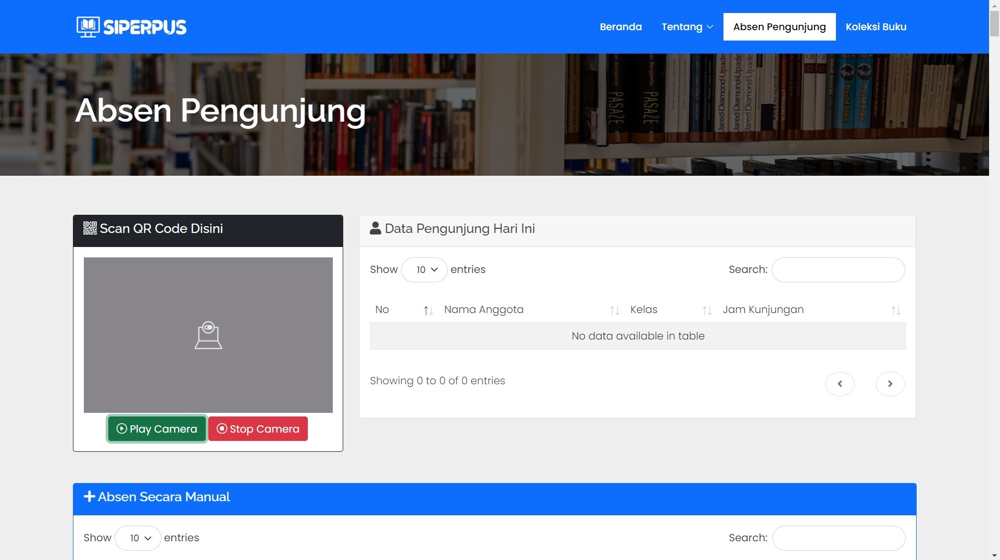
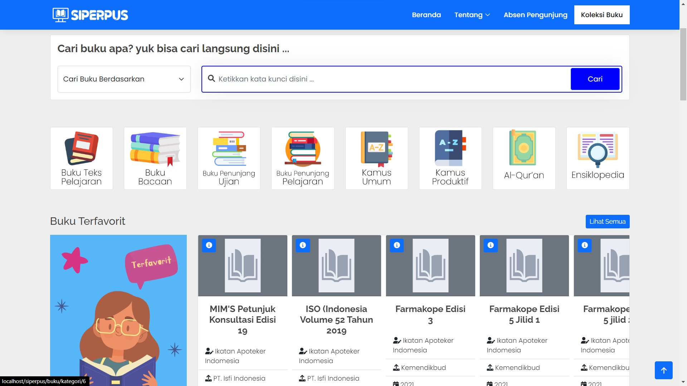

########################################
Sistem Informasi Perpustakaan (SIPERPUS)
########################################

Sistem Informasi Perpustakaan (SIPERPUS) merupakan aplikasi pengolah data yang dikhususkan untuk perpustakaan sekolah.
Pada dasarnya aplikasi ini diharapkan membantu petugas perpustakaan untuk mengolah data buku hingga peminjaman dan pengembalian.
Selain itu siswa juga dapat mencari informasi buku dengan mudah dengan menu pencarian buku. 
Project ini diinstalasi secara lokal pada SMK Soedirman Purbalingga, Prov. Jawa Tengah.

*********************
Pengembangan Aplikasi
*********************

Aplikasi terdapat 2 bagian yang terpisah antara lain :

- Front End (client-side)
- Back End (server-side)

=========
Front End
=========

Bagian ini dikhususkan untuk siswa. Siswa dapat mencari informasi buku pada komputer yang diinstalasi khusus siswa.
Informasi yang diberikan pada siswa antara lain nama buku, pengarang hingga lokasi buku pada rak perpustakaan,
sehingga siswa dapat dengan mudah mengetahui lokasi buku tersebut.

Siswa juga dapat melihat informasi mengenai struktur organisasi, sejarah dan visi misi sekolah.
Dan yang tidak kalah menarik siswa dapat melakukan absen kunjungan dengan menggunakan QR Code pada kartu perpustakaannya yang digenerate dari sisi Backend.

Berikut adalah beberapa screenshot aplikasinya:

========
Back End
========

Bagian ini diperuntukkan untuk petugas perpustakaan dalam mengelola data mulai dari data buku hingga peminjaman dan pengembalian.

--------------------------
Hak Akses Customer Service
--------------------------
====  =====
No     Hak Akses CS
====  =====
1      Mengelola Data Produk
2      Mengelola Data Paket Produk
3      Mengelola Data Treatment
4      Mengelola Data Pelanggan
5      Mengelola Data Penjualan
6      Mengelola Data Dokter
7      Mengelola Data Jadwal Dokter
8      Mengelola Data Laporan Pelanggan
9      Mengelola Data Laporan Produk
10      Mengelola Data Laporan Penjualan
11      Mencetak Struk Belanja
====  =====

---------------
Hak Akses Owner
---------------
====  =====
No     Hak Akses Owner
====  =====
1      Mengelola Data Pembelian
2      Menambahkan Akses CS
3      Melihat Data Penjualan
====  =====

Berikut adalah beberapa screenshot aplikasinya:

.. image:: assets/img/ss/nysfo_backend_1.jpg
   :alt: Front End 1

.. image:: assets/img/ss/nysfo_backend_2.jpg
   :alt: Front End 2

.. image:: assets/img/ss/nysfo_backend_3.jpg
   :alt: Front End 3

******************
Ucapan Terimakasih
******************

Saya menyadari project ini tidak akan selesai tanpa bantuan dari Bpk. Prastya Widjaja, SE dan Ibu dr. Lina Wijaya selaku owner.
Maka dari itu saya ucapkan terimakasih atas kepercayaannya.
