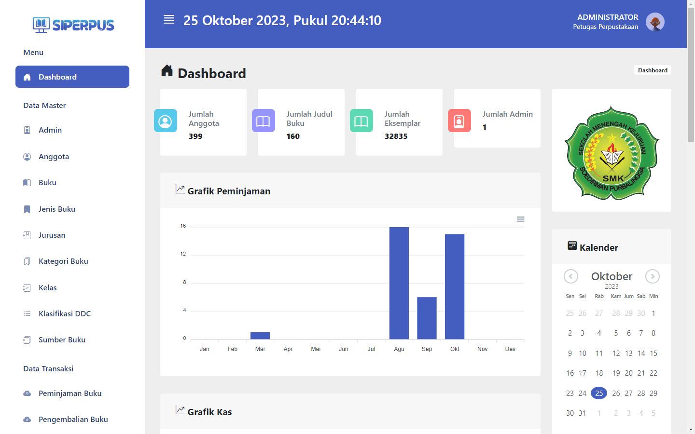
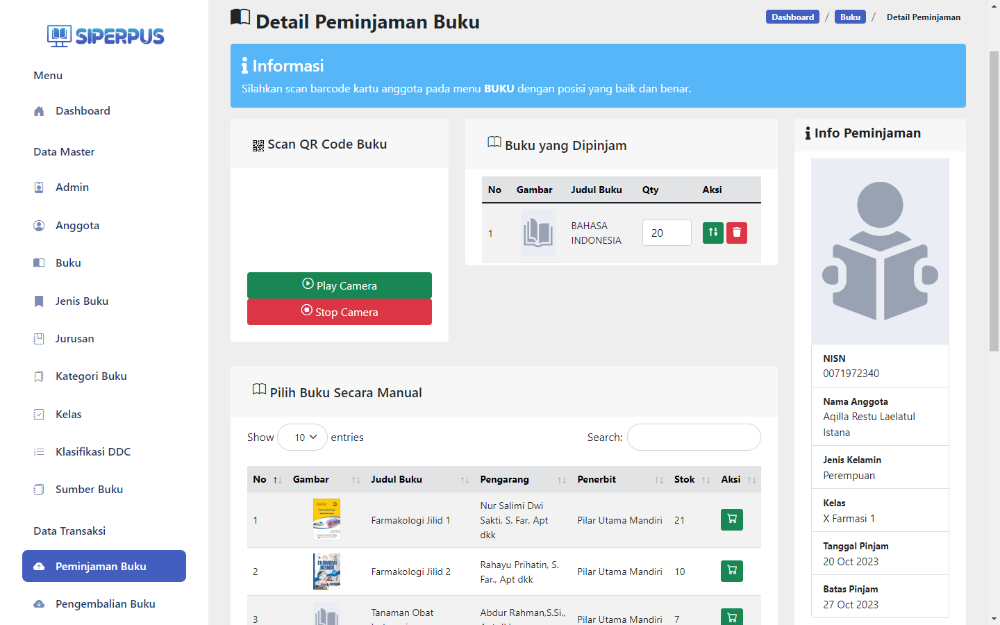
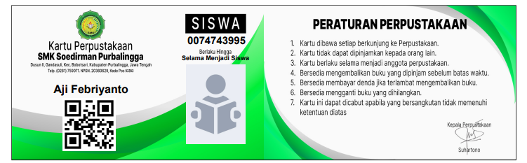

########################################
Sistem Informasi Perpustakaan (SIPERPUS)
########################################

Sistem Informasi Perpustakaan (SIPERPUS) merupakan aplikasi pengolah data yang dikhususkan untuk perpustakaan sekolah.
Pada dasarnya aplikasi ini diharapkan membantu petugas perpustakaan untuk mengolah data buku hingga peminjaman dan pengembalian.
Selain itu siswa juga dapat mencari informasi buku dengan mudah dengan menu pencarian buku. 
Project ini diinstalasi secara lokal pada SMK Soedirman Purbalingga, Prov. Jawa Tengah.

*********************
Pengembangan Aplikasi
*********************

Aplikasi terdapat 2 bagian yang terpisah antara lain :

- Front End (client-side)
- Back End (server-side)

=========
Front End
=========

Bagian ini dikhususkan untuk siswa. Siswa dapat mencari informasi buku pada komputer yang diinstalasi khusus siswa.
Informasi yang diberikan pada siswa antara lain nama buku, pengarang hingga lokasi buku pada rak perpustakaan,
sehingga siswa dapat dengan mudah mengetahui lokasi buku tersebut.

Siswa juga dapat melihat informasi mengenai struktur organisasi, sejarah dan visi misi sekolah.
Dan yang tidak kalah menarik siswa dapat melakukan absen kunjungan dengan menggunakan QR Code pada kartu perpustakaannya yang digenerate dari sisi Backend.

---------------
Hak Akses Siswa
---------------
====  =====
No     Hak Akses
====  =====
1      Mencari Buku
2      Melihat Informasi Perpustakaan
3	    Melakukan Absen Kunjungan
====  =====

Berikut adalah beberapa screenshot aplikasinya:

.. image:: assets/img/dokumentasi/siperpus_frontend_1.jpg
   :alt: Front End 1

.. image:: assets/img/dokumentasi/siperpus_frontend_2.jpg
   :alt: Front End 2

.. image:: assets/img/dokumentasi/siperpus_frontend_3.jpg
   :alt: Front End 3

========
Back End
========

Bagian ini diperuntukkan untuk petugas perpustakaan dalam mengelola data mulai dari data buku hingga peminjaman dan pengembalian.

------------------------------
Hak Akses Petugas Perpustakaan
------------------------------
====  =====
No     Hak Akses
====  =====
1      Mengelola Data Anggota
2      Mengelola Data Buku
3      Mengelola Data Jenis Buku
4      Mengelola Data Jurusan
5      Mengelola Data Kategori Buku
6      Mengelola Data Kelas
7      Mengelola Data Klasifikasi DDC
8      Mengelola Data Sumber Buku
9      Mengelola Data Peminjaman
10     Mengelola Data Pengembalian
11     Mengelola Data Laporan Anggota
12     Mengelola Data Laporan Buku
13     Mengelola Data Laporan Kas
14     Mencetak Kartu Perpustakaan Siswa
15     Mencetak Kartu Label Buku
====  =====

Berikut adalah beberapa screenshot aplikasinya:

******************
Ucapan Terimakasih
******************

Saya menyadari project ini tidak akan selesai tanpa bantuan dari Bpk. Sehartono selaku Kepala Perpustakaan SMK Soedirman Purbalingga
dan Sdri Dila selaku Petugas Perpustakaan SMK Soedirman Purbalingga. Maka dari itu saya ucapkan terimakasih atas kepercayaannya.
